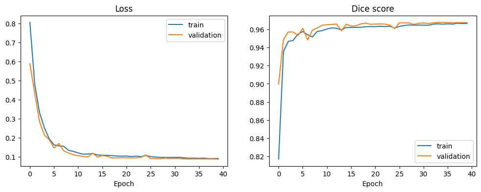
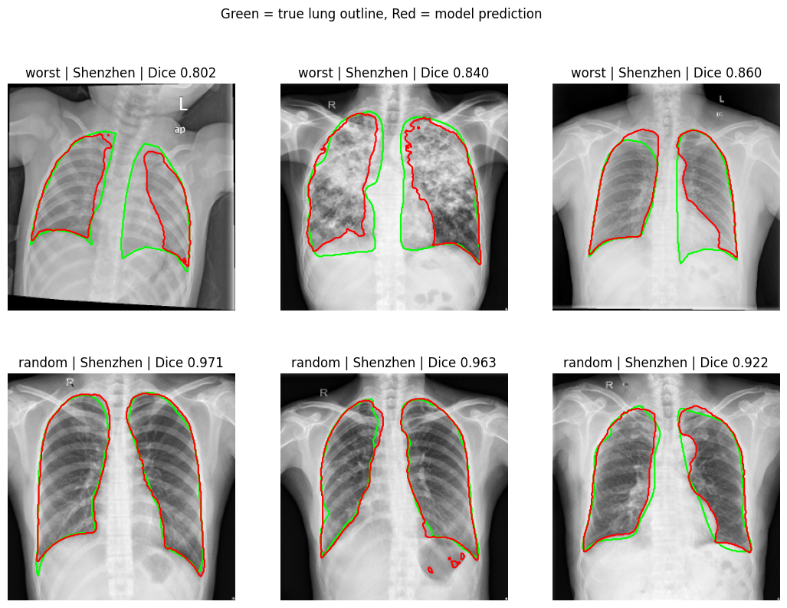

# Lung Segmentation with U-Net

A U-Net that segments the lungs in chest X-rays, written from scratch in PyTorch. It is evaluated with Dice and IoU on a held-out test set, with a look at where it fails.

## Results

Evaluated once on 106 held-out test images, which were not used for training or for choosing the checkpoint.

| Subset | Images | Dice mean (std) | Dice median | IoU mean |
|---|---|---|---|---|
| All | 106 | 0.9615 (0.0332) | 0.9736 | 0.9276 |
| Montgomery | 21 | 0.9765 (0.0142) | 0.9800 | 0.9545 |
| Shenzhen | 85 | 0.9578 (0.0354) | 0.9714 | 0.9210 |

The median is higher than the mean because a few hard cases pull the mean down.

The best checkpoint was chosen on a separate validation set (Dice 0.9676 at epoch 34). Train and validation curves stay close together, so there is no sign of overfitting.



### Predictions

The top row shows the three worst test cases. The bottom row shows three random cases. Green is the reference outline and red is the model prediction.



## Dataset

The Montgomery and Shenzhen parts of the "Chest X-ray dataset for lung segmentation" (Danilov et al., 2022), licensed CC BY 4.0. Together they give 704 chest X-rays with binary lung masks (138 Montgomery, 566 Shenzhen). The large Darwin part of the dataset is not used.

- Dataset: Danilov V, Proutski A, Kirpich A, Litmanovich D, Gankin Y. Chest X-ray dataset for lung segmentation. Mendeley Data, V2, 2022. https://doi.org/10.17632/8gf9vpkhgy.2
- Montgomery and Shenzhen original source: Jaeger S, Candemir S, Antani S, Wang Y-XJ, Lu P-X, Thoma G. Two public chest X-ray datasets for computer-aided screening of pulmonary diseases. Quant Imaging Med Surg. 2014;4:475-477.

The data is not included in this repository. Download it from the link above. The loader expects this layout:

```
data_root/
  Montgomery/img/   Montgomery/mask/
  Shenzhen/img/     Shenzhen/mask/
```

## Method

- **Split:** 70/15/15 into train, validation and test (492 / 106 / 106), stratified by source dataset, with a fixed seed. The test set is used once, at the end.
- **Preprocessing:** images resized to 256 x 256 grayscale. Masks are thresholded at 127 first, because the provided masks contain soft edge values, and then resized with nearest-neighbour.
- **Augmentation (training only):** rotation within 10 degrees, scale 0.9 to 1.1, brightness and contrast changes. No horizontal flips, because a flip would swap the lungs and put the heart on the wrong side.
- **Model:** U-Net with four down and four up steps, 32 base channels, 7.76 million parameters, trained from scratch.
- **Loss:** binary cross-entropy plus Dice loss.
- **Training:** Adam, learning rate 0.001 halved when validation Dice stalls for 5 epochs, batch size 8, 40 epochs, on a Colab GPU.
- **Checkpoint:** the epoch with the best validation Dice.

## Repository layout

```
src/lung_seg/
  data.py       pairing, splitting, augmentation, loaders
  model.py      U-Net
  metrics.py    Dice + BCE loss, Dice and IoU scores
  train.py      training loop and curves
  evaluate.py   test scoring and prediction plots
tests/          9 automated tests
results/        figures
```

## Usage

```python
import sys
sys.path.insert(0, "src")
import torch
from lung_seg.data import get_dataloaders
from lung_seg.model import UNet
from lung_seg.train import train_model

device = torch.device("cuda" if torch.cuda.is_available() else "cpu")
train_loader, val_loader, test_loader = get_dataloaders("path/to/data_root")
model = UNet().to(device)
history, best_val_dice = train_model(model, train_loader, val_loader, device)
```

Trained weights (`best_unet.pt`) are attached to the Releases section of this repository.

```bash
pip install -r requirements.txt
pytest tests/
```

## Limitations and failure cases

- **Small, two-source data.** The model was trained and tested on 704 images from two hospitals' public datasets. It has not been tested on any outside data, so these scores say little about performance elsewhere.
- **Small test set.** Only 21 test images come from Montgomery, so the gap between the two sources is uncertain. Results come from a single split and a single training run, with no confidence intervals.
- **The worst cases are all Shenzhen** (Dice 0.80 to 0.86). In these, the model appears to miss parts of lungs that look unusual: dense, patchy opacities, or an atypical position or tilt. This reading comes from looking at a handful of images and was not tested further.
- **Reference outlines are imperfect.** In some of the worst cases the reference outline itself looks loose, so part of the gap may be annotation noise. This was not reviewed by a radiologist.
- **False positives.** Gas in the stomach below the left lung is sometimes predicted as lung.
- **Resolution.** Images were reduced to 256 x 256 for speed, so fine edge detail is lost.

This project is for education and research only. It is not a medical device and must not be used for clinical decisions.

### Possible next steps

Keep only the largest connected regions to remove stray false positives. Train at higher resolution. Compare with a pretrained encoder. Test on the Darwin images as an outside check. Use cross-validation for tighter estimates.

## License

MIT. The dataset has its own licence (CC BY 4.0).
